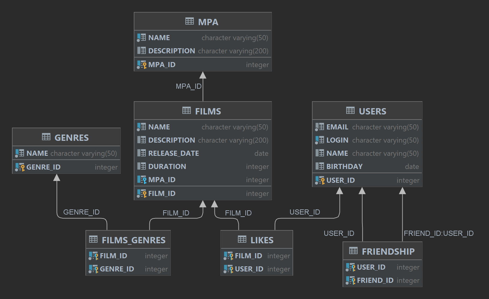

# java-filmorate

## Endpoints

### Films
- `[GET] /films` – получить список всех фильмов
- `[GET] /films/{id}` – получить фильм `id`
- `[POST] /films` – создать новый фильм
- `[PUT] /films` – обновить фильм
- `[DELETE] /films/{id}` - удалить фильм `id`
- `[GET] /films/popular` – получить топ 10 самых популярных фильмов
- `[GET] /films/popular?count={count}` – получить топ `count` самых популярных фильмов
- `[PUT] /films/{id}/like/{userId}` – поставить лайк фильму `id` от пользователя `userId`
- `[DELETE] /films/{id}/like/{userId}` – удалить лайк у фильма `id` от пользователя `userId`
- `[GET] /films/director/{directorId}?sortBy=[year,likes]` - получить список фильмов режиссера отсортированных 
по количеству лайков или году выпуска
- `[GET] /films/search?query={query}&by={[director,title]}` - поиск по имени режиссера или по названию фильма

### Users
- `[GET] /users` – получить список всех пользователей
- `[GET] /users/{id}` – получить пользователя `id`
- `[POST] /users` – создать нового пользователя
- `[PUT] /users` – обновить пользователя
- `[DELETE] /users/{id}` - удалить пользователя `id`
- `[PUT] /users/{id}/friends/{friendId}` – добавить пользователю `id` в друзья пользователя `friendId`
- `[DELETE] /users/{id}/friends/{friendId}` – удалить у пользователя `id` из друзей пользователя `friendId`
- `[GET] /users/{id}/friends` – получить список всех друзей пользователя `id`
- `[GET] /users/{id}/friends/common/{otherId}` – получить список общих друзей пользователей `id` и `otherId`
- `[GET] /users/{id}//recommendations` – получить список рекомендованных фильмов для пользователя `id`

### Mpa
- `[GET] /mpa` – получить список всех возрастных рейтингов
- `[GET] /mpa/{id}` – получить возрастной рейтинг `id`

### Genres
- `[GET] /genres` – получить список всех жанров
- `[GET] /genres/{id}` – получить жанр `id`

### Directors
- `[GET] /directors` – получить список всех режиссеров
- `[GET] /directors/{id}` – получить режиссера `id`
- `[POST] /directors` – создать нового режиссера
- `[PUT] /directors` – обновить режиссера
- `[DELETE] /directors/{id}` – удалить режиссера `id`

## Схема базы данных

